**MongoDB**

Contents:  

1. Prerequisites  
2. Project Overview  
3. Step 1: Create a New Mule Studio Project  
4. Step 2: Configure the HTTP Endpoint  
5. Step 3: Configure the MongoDB Cloud Connector  
6. Step 4: Configure the Expression Transformer  
7. Step 5: Add Foreach Component  
8. Step 6: Use some operations  
9. Step 7: Add Logger Component  
10. Step 8: Run the Project  
11. How the Project Works  
12. Next Steps

**Prerequisites**

This tutorial assumes that you have the following software downloaded, installed and configured. Please take a moment to review them if you haven't already done so.

Installing and Running MongoDB  

- [docs.mongodb.org/manual/installation](http://docs.mongodb.org/manual/installation/)  
- [docs.mongodb.org/manual/tutorial/getting-started](http://docs.mongodb.org/manual/tutorial/getting-started/)

Installing and Running MuleStudio  

- [www.mulesoft.org/documentation/display/MULE3STUDIO/Installing+Mule+Studio](http://www.mulesoft.org/documentation/display/MULE3STUDIO/Installing+Mule+Studio)

Installing MongoDB Connector  

- [www.mulesoft.org/documentation/display/MULE3STUDIO/Additional+Cloud+Connectors](http://www.mulesoft.org/documentation/display/MULE3STUDIO/Additional+Cloud+Connectors)

**Project Overview**

This tutorial introduces the MongoDB cloud connector, and describes additional concepts.
Completing this tutorial should take about 45 minutes. You will accomplish the following:

- Learn about cloud connectors, and build a project that accesses a MongoDB database using Mule Studio  
- Learn about the Expression Transformer, Foreach Scope and the Logger Component

With cloud connectors, you can leverage many Software-as-a-Service (SaaS) platforms and quickly build cloud-to-cloud integrations, cloud-to-on-site applications, and much more. This tutorial introduces you to the MongoDB cloud connector, and shows you how to configure it to access your database. The tutorial also discusses payloads and shows you how to use expressions, using the Mule Expression Language, to modify and view messages at various points in the project flow.

Key Concepts Covered in this Tutorial:
<table>
<tr>
<th>Component</th>
<th>Description</th>
</tr>
<tr>
<td> MongoDB </td>
<td>To demonstrate how cloud connectors simplify API integration, this project uses the MongoDB cloud connector to access a database and create a collection.</td>
</tr>
<tr>
<td> HTTP </td>
<td>HTTP Endpoint to send and receive requests over HTTP transport protocol.</td>
</tr>
<tr>
<td> Expression </td>
<td>The Expression Transformer evaluates one or more expressions in the current message.</td>
</tr>
<tr>
<td> Logger </td>
<td>The Logger Component performs logging using an expression that determines what should be logged.</td>
</tr>
<tr>
<td> Mule Expression Language </td>
<td>Mule Expression Language is used in various components to process the payload.</td>
</tr>
<tr>
<td>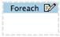 Foreach </td>
<td>It iterates over a collection of elements present in the current message.</td>
</tr>
</table>

**Step 1: Create a New Mule Studio Project** 

To begin building this application, start Mule Studio and create a new project:  
1. Select **File -\> New -\> Mule Project**  
2. In the New Mule Project configuration menu, provide a name for this project: *mongo\_demo*  
3. Click **Next** and provide a name for the flow: *mongo-demo*  
4. Click **Finish**.

A new project opens with a blank canvas for building the flow, and the Palette with Message Processors to the right.

**Step 2: Configure the HTTP Endpoint**

The first component (also called a message processor) in the flow is a HTTP Endpoint. This Endpoint will launch a web page at the URL you choose when deploying the project.

1. Locate the **HTTP** component in the **Endpoints** category of the Palette. Drag and place it on the canvas. Since you are placing the first component on the canvas, Mule Studio will create a containing-box around it, and label it "mongo-demoFlow1". As you add additional components to the flow, you will want to place them inside this same containing box.  

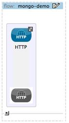

2. Open the HTTP Endpoint configuration menu. To do so, double-click on the component you just placed on the canvas, or choose "Properties" from its context menu.  
3. Leave the default Port (**8081**) and Host (**localhost**).  
4. Enter **mongo** in the Path field.  
5. Click **OK** to close the configuration menu. 
 
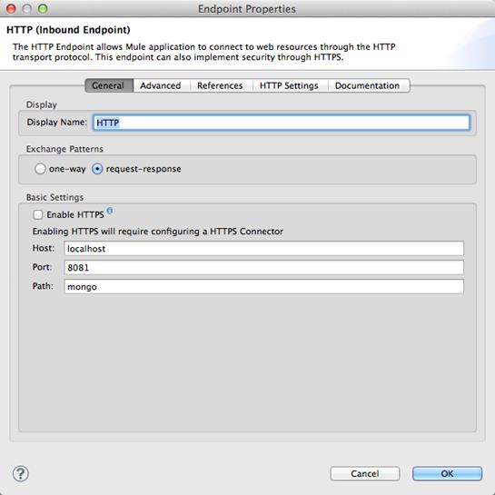  

**Step 3: Configure the MongoDB Cloud Connector**

1. Locate the **MongoDB** message processor in the **Cloud Connectors** category of the Palette. Drag and place it on the canvas to the right of the HTTP Endpoint.  

2. Double-click on the Mongo cloud connector in your flow to open its properties menu.  
3. Note an error stating that "config-ref" is required, and an "x" next to the Config Reference form field. Click on the "+" icon next to this form field to create a "MongoDB Global Element".  
4. A **Global Element** properties menu opens. Fill username, password, host, port and database. By default, a MongoDB database uses "admin" as a username with no password and listens on localhost port 27017 for connections, so unless your instance of MongoDB has been configured differently you should be able to use these values.  

Note:

A *Global Element*allows to enter configuration information, such as your API credentials, once. You can then reference the Global Element many times within your flow (although for this project we only need to reference it once). Note the Global Elements tab under the Mule Studio canvas; this tab provides an alternative view for managing all Global Elements defined for this project.

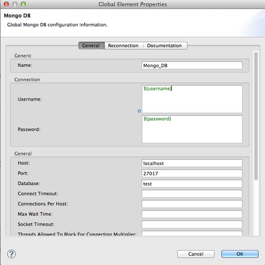

5. The MongoDB Properties menu should still be open. Notice that the Config Reference field has been updated to point to the new "Mongo\_DB" Global Element.  
6. Select **Create Collection** from the Operation drop-down field.  
7. Enter *movies* in the Collection field.  
8.  Click **OK** to close the MongoDB Properties menu.

The MongoDB cloud connector configuration is complete. The red "x" next to its icon in the flow should no longer be present.

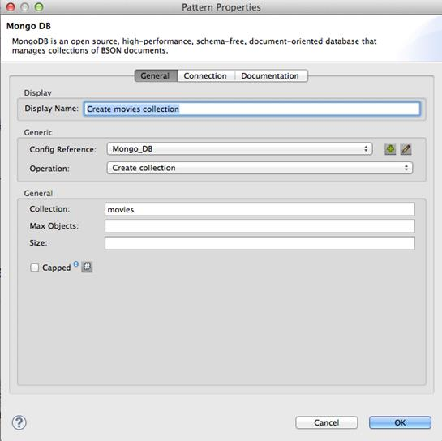

**Step 4: Configure the Expression Transformer**

1. Locate the **Expression** component in the **Transformers** category of the Palette. Drag and place it on the canvas to the right of the MongoDB Cloud Connector.  
2. Double-click on the **Expression** Transformer to open its properties menu.  
3. Change the Display Name to **Define Movies.**  
4. Enter **\#[['****The Godfather****'****,****'****Pulp Fiction****'****,****'****The Dark Knight****'****,****'****Fight Club****'****,****'****Star Wars****']]** in the Expression field.  
5. Click **OK** to close the Expression Transformer Properties menu.

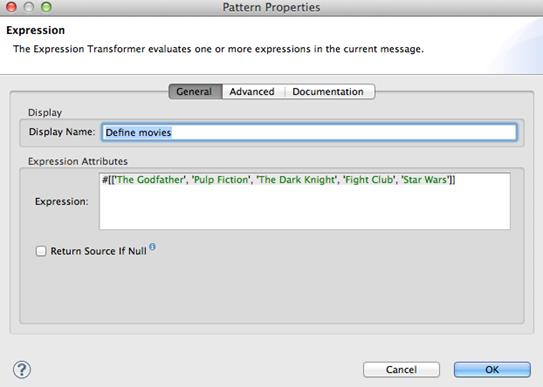

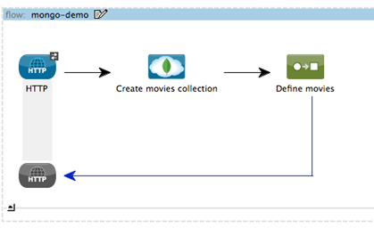

**Step 5: Add Foreach Component**

1. Locate the **Foreach** component in the **Scopes** category of the Palette. Drag and place it on the canvas to the right of the expression component.  
2. Double-click on the **Foreach** Scope to open its properties menu.  
3. Change the Display Name to **Insert all movies.**  
4. Enter **\#[payload]** in the Collection field and 1 in the Batch Size field.  
6.Click **OK** to close the Foreach Scope Properties menu.

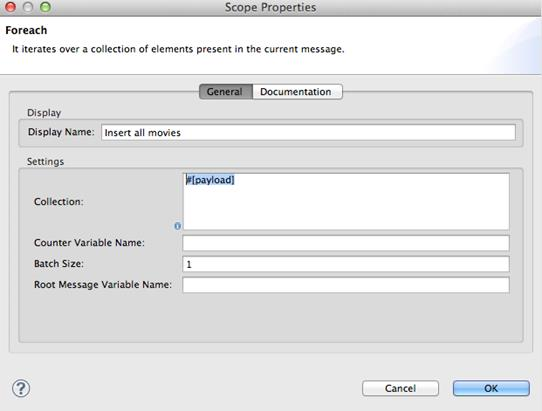

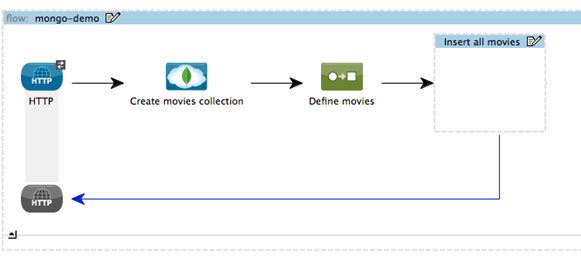

**Step 6: Use some operations**

Insert another MongoDB cloud connector inside the Foreach scope and configure it to Insert object from map: the configuration will look like this:

  

Note: Instead of Create a list, select Create Object manually and click to icon with three dots (...). In the new window that pops up, click the Plus icon to add a new configuration, the select the configuration, click the Edit icon, and enter "#[payload]" in the Value field.

Add another MongoDB cloud connector after (outside of) the Foreach scope. Configure it to Find objects: the configuration will look like this:

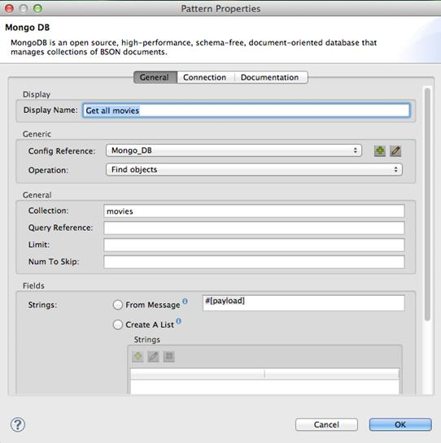

Add a MongoDB transformer after the last MongoDB cloud connector and configure the operation like this:

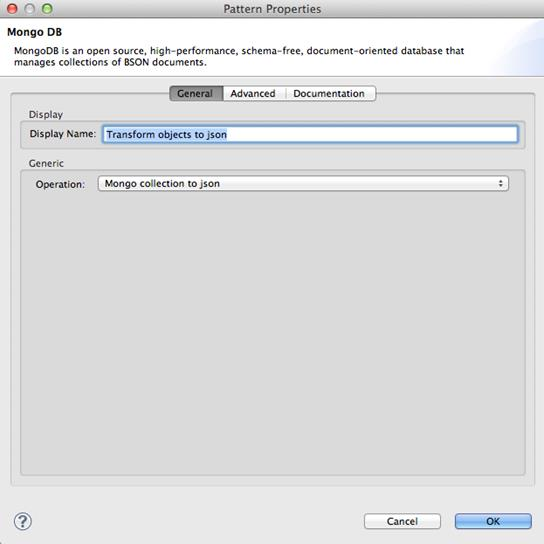  

When finished, the flow should look like this:

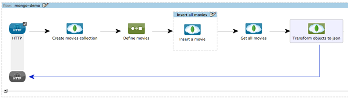

**Step 7: Add Logger Component**

In this project, we will add two Logger components to the flow. In doing so, we will be able to view the data going into the MongoDB Cloud Connector, and the subsequent response payload produced by MongoDB.

1. Locate **Logger** in the **Components** category of the Palette. Drag and place it on the canvas to the right of the last operation.  
2. Double-click on the **Logger** Component to open its properties menu.  
3. Enter **\#[payload]** in the Message field.  
4. Click **OK** to close this Properties menu.

Note:  
In both cases, leave the "Level" to "info", as this will generate log entries while the application runs normally. If set to "error", as an example, log entries would only be generated on an error while executing the application, which is useful for debugging issues.

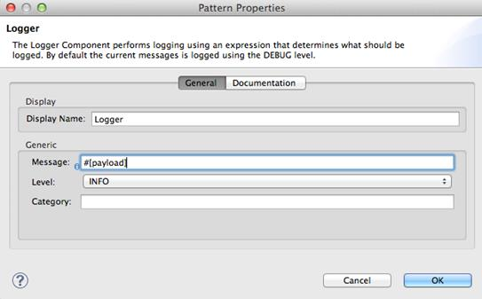

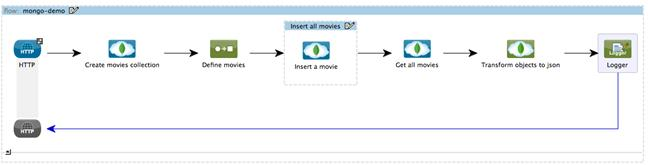

**Step 8: Run the project**

You are now ready to run the project! First, you need to run the flow form Studio, then open your favorite browser and type <http://localhost:8081/mongo> and finally see the results.

**How the Project Works**

In this section, we'll take an inside look at messages within the flow, and see how expressions allow us to control which data is sent to MongoDB. We'll also revisit with the Logger component and view the output they produce in the Studio console.

*About the Payload*  
The flow we built in Mule Studio contains message processors –- including the HTTP Endpoint, MongoDB Cloud Connector and Expression Transformer —- and it is "Mule messages" that carry data between these message processors.

A Mule message contains the following components:  

- Payload – this is the actual data that we are concerned with in this application  
- Properties—Along with a set of standard parameters, user defined parameters may be included as well.  
- Attachments—Although not used in this projects, other applications may include attachments such as an XML file or PDF attachment.

*About the Mule Expression Language*  
Messages within the Mule flow can be quite complex, and it is often necessary to perform some operation on them, or extract pertinent information. In this project, we needed to create a list of movies and send it to the MongoDB connector. The Mule Expression Language was used to do so.

The Mule Expression Language provides a powerful and comprehensive set of features. In this project, we used expressions at several points in the flow:

- The Expression Transformer used the following Mule expression to create the list of movies: **\#[['****The Godfather****'****,****'****Pulp Fiction****'****,****'****The Dark Knight****'****,****'****Fight Club****'****,****'****Star Wars****']]**  
- The logger component extracted the payload generated by MongoDB: **\#[payload]**

**Next Steps**

For further information about this cloud connector, see these references:

- [mulesoft.github.com/mongo-connector/mule/mongo.html](mulesoft.github.com/mongo-connector/mule/mongo.html)  
- [www.mongodb.org/display/DOCS/Home](www.mongodb.org/display/DOCS/Home)
